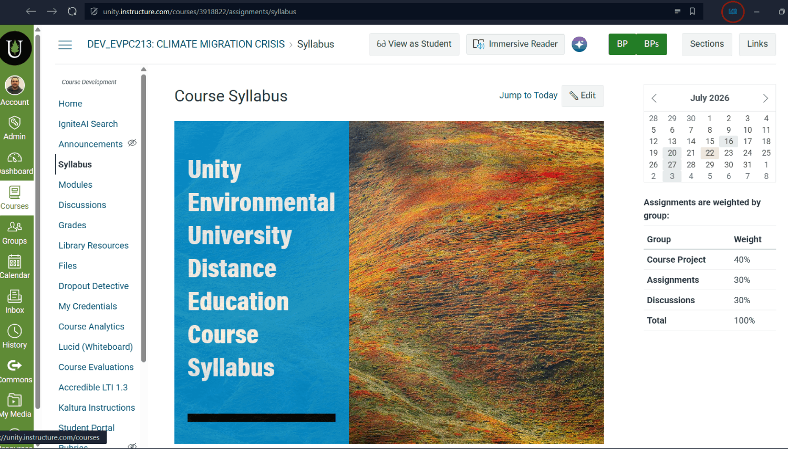
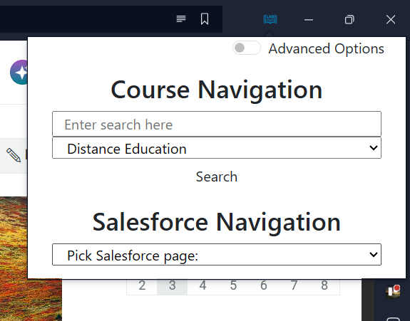
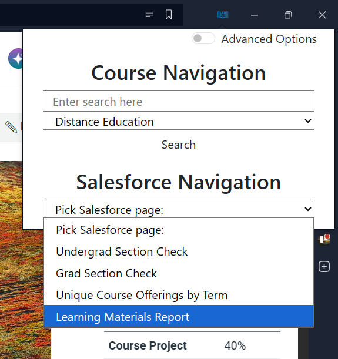

<!-- TODO Size images -->

# How to view the Course Materials Report from a Course

If you are in a Canvas course, you can view what the course's listed material is in Salesforce quickly using the extension.

## Open the LXD Extension Menu

- In the top bar of your browser, click the little book icon to open up the extension menu

## Click the Salesforce Navigation drop down

- In the extension menu, click the Salesforce Navigation dropdown.

## Select 'Learning Materials Report'

- In the dropdown, select 'Learning Materials Report.' This will open a new tab and attempt to take you to the Course Materials Report in Salesforce.
  - You may need to log in to the Unity SSO Portal.
  - If you are in a Canvas course in your tab when you click this, you will be taken to the report filtered by that course.
  - If that course doesn't have any learning materials in Salesforce, you will get zero results.
  - If you are not in a course, you will see the report unfiltered.

